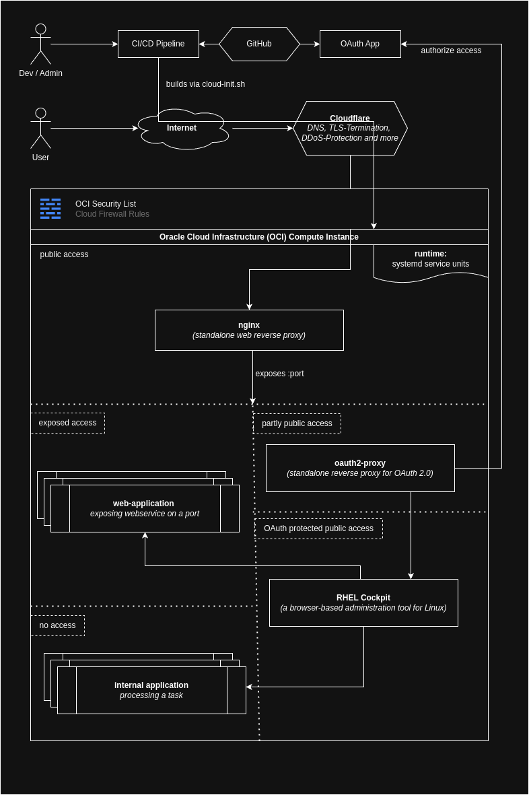

# Free & Open Source Oracle Cloud Infrastructure (OCI) Instance Setup

This repository provides a streamlined and reproducible setup for a free Oracle Cloud Infrastructure (OCI) instance using GitHub CI/CD pipelines. The instance is secured via Cloudflare and features an Nginx reverse proxy for exposing APIs or web services with optional OAuth 2.0 authentication. Additionally, RHEL Linux Cockpit enables web-based administration of the instance.

## Prerequisites
To use this setup, you will need the following:
- **Cloudflare Account** (Free Plan)
- **GitHub Account** (Free Plan)
- **Oracle Cloud Infrastructure (OCI) Account** (Always Free Resources)

## Architecture


## Technology Stack
This project leverages the following technologies and tools:
- **[RHEL Linux Cockpit](https://github.com/cockpit-project/cockpit)** – Web-based server administration
- **[OAuth2-Proxy](https://github.com/oauth2-proxy/oauth2-proxy)** – Reverse proxy with OAuth authentication
- **[Nginx](https://github.com/nginx/nginx)** – Reverse proxy for web services
- **[Systemd](https://github.com/systemd/systemd)** – Service and application runtime management
- **[Qodana](https://github.com/JetBrains/Qodana)** – Static code analysis for CI/CD pipelines
- **[GitHub Actions](https://github.com/solutions/use-case/ci-cd)** – CI/CD pipeline for deployment
- **[Oracle Cloud Infrastructure (OCI)](https://www.oracle.com/cloud/)** – Cloud provider
- **[Cloudflare](https://www.cloudflare.com/)** – DNS management, TLS termination, monitoring, and security
- **[Bash/Shell Scripting](https://en.wikipedia.org/wiki/Bash_(Unix_shell))** – Automation via CI/CD pipelines
- **[Python](https://en.wikipedia.org/wiki/Python_(programming_language))** – Sample web service implementation

## Setup Instructions
To deploy this infrastructure, follow these steps:

### 1. Configure Your Domain in Cloudflare
- Ensure your top-level domain (TLD) is correctly set up in Cloudflare.

### 2. Create an OCI Instance
- Manually create a free-tier instance in OCI.
- Alternatively, use Terraform to automate this step.

### 3. Clone or Fork the Repository
- Clone or fork this repository to your GitHub account.

### 4. Adjust Configuration Files
- **Modify Cloud Init Script:** Update `./src/cloud-init.sh` to match your application's requirements.
- **Update CI/CD Pipeline:** Modify `./.github/run-ssh.yml` to fit your deployment workflow.

### 5. Set Repository Secrets
Add the following secrets to your GitHub repository for `.env` generation:

```
REPLACE_SECRET_SSH_USER: ${{ secrets.SSH_USER }}
REPLACE_SECRET_SSH_HOST: ${{ secrets.SSH_HOST }}
REPLACE_SECRET_PUBLIC_HOST: ${{ secrets.PUBLIC_HOST }}
REPLACE_SECRET_CLOUDFLARE_API_KEY: ${{ secrets.CLOUDFLARE_API_KEY }}
REPLACE_SECRET_CLOUDFLARE_ZONE_ID: ${{ secrets.CLOUDFLARE_ZONE_ID }}
REPLACE_SECRET_CLOUDFLARE_RECORD_ID: ${{ secrets.CLOUDFLARE_RECORD_ID }}
REPLACE_SECRET_COCKPIT_PASSWORD: ${{ secrets.COCKPIT_PASSWORD }}
REPLACE_SECRET_GITHUB_USER: ${{ secrets.P_GITHUB_USER }}
REPLACE_SECRET_GITHUB_TOKEN: ${{ secrets.P_GITHUB_TOKEN }}
REPLACE_SECRET_GITHUB_CLIENT_ID: ${{ secrets.P_GITHUB_CLIENT_ID }}
REPLACE_SECRET_GITHUB_CLIENT_SECRET: ${{ secrets.P_GITHUB_CLIENT_SECRET }}
REPLACE_SECRET_GITHUB_COOKIE_SECRET: ${{ secrets.P_GITHUB_COOKIE_SECRET }}
REPLACE_SECRET_MY_EMAIL_ADDRESS: ${{ secrets.MY_EMAIL_ADDRESS }}
REPLACE_SECRET_MY_OAUTH_EMAIL_HOST: ${{ secrets.MY_OAUTH_EMAIL_HOST }}
```

### 6. Execute the GitHub Action Pipeline
- Trigger a GitHub Action pipeline to deploy your instance.

## Administration Cheat Sheet

### Remove All Service Definitions
```shell
systemctl list-units --all | awk '{print $2}' | grep demo-service | xargs -I{} sudo systemctl stop {}
systemctl list-units --all | awk '{print $2}' | grep demo-service | xargs -I{} sudo systemctl disable {}

find /usr/lib/systemd/system/ -name '*demo-service*' -exec sudo rm -f {} +
find /etc/systemd/system/ -name '*demo-service*' -exec sudo rm -f {} +
sudo systemctl daemon-reload
sudo systemctl reset-failed
```

```shell
sudo systemctl stop demo-service-* && \
sudo rm -rf /usr/lib/systemd/system/demo-service-* && \
sudo rm -rf /etc/systemd/system/demo-service-* && \
sudo systemctl daemon-reload && \
sudo systemctl reset-failed && \
sudo journalctl --rotate && \
sudo journalctl --vacuum-time=1s && \
echo "Cleanup completed"
```

### Manage Service Instances
**Stop all instances:**
```shell
sudo systemctl stop demo-service-*
```
**Restart all instances:**
```shell
sudo systemctl restart demo-service-*
```
**Enable all instances:**
```shell
sudo systemctl enable demo-service-*
```
**Disable all instances:**
```shell
sudo systemctl disable demo-service-*
```

## Local Development of a Web Service

### 1. Build the Docker Image
```shell
docker build -t demo-microservice .
```

### 2. Run the Docker Container
```shell
docker run -d \
  --name demo-microservice-instance \
  -v $(pwd)/.env:/app/.env:ro \
  demo-microservice
```

### Alternative Deployment Without Mounting .env
```shell
docker run -d \
  --name demo-microservice-instance \
  -e ENVIRONMENT_VARIABLE_NAME="your-value" \
  -e APP_VARIABLE_NAME="-123456789" \
  -e ENV_USERNAMES="user1,user2" \
  demo-microservice
```

### Debugging Inside the Container
```shell
docker run -it demo-microservice /bin/bash
```
```shell
docker run -it \
  -v $(pwd)/.env:/app/.env:ro \
  -v $(pwd)/logs:/app/logs \
  -v $(pwd)/records:/app/records \
  demo-microservice \
  /bin/bash
```

To manually run the Python service inside the container:
```shell
export $(cat .env | xargs) && LOG_LEVEL=INFO python main.py
```

## Examples
- [kutu.stream](https://kutu.stream/)

